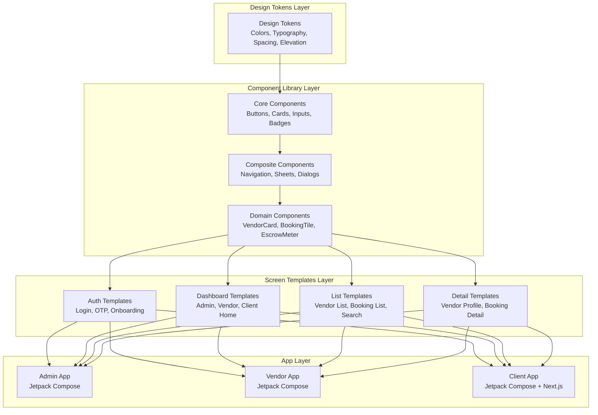
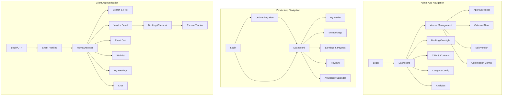
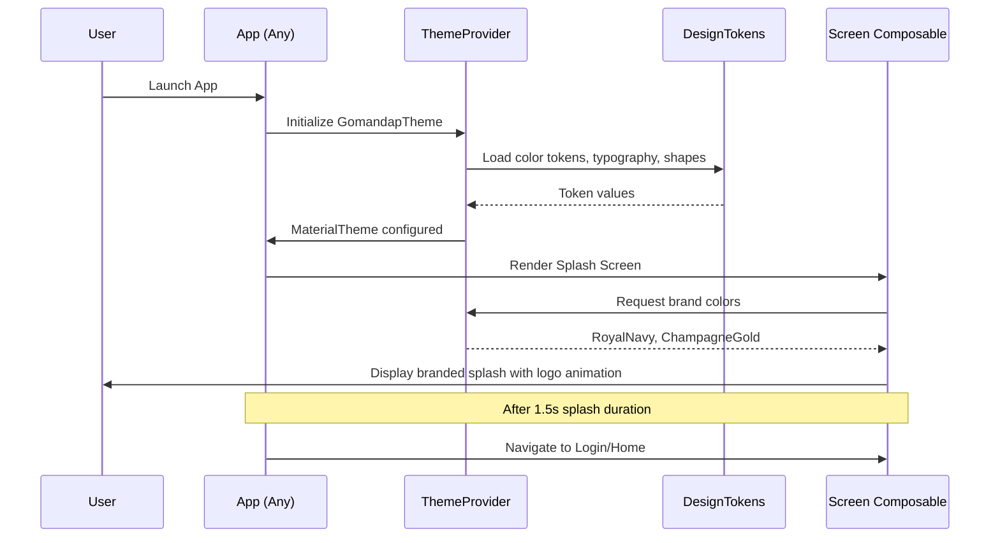
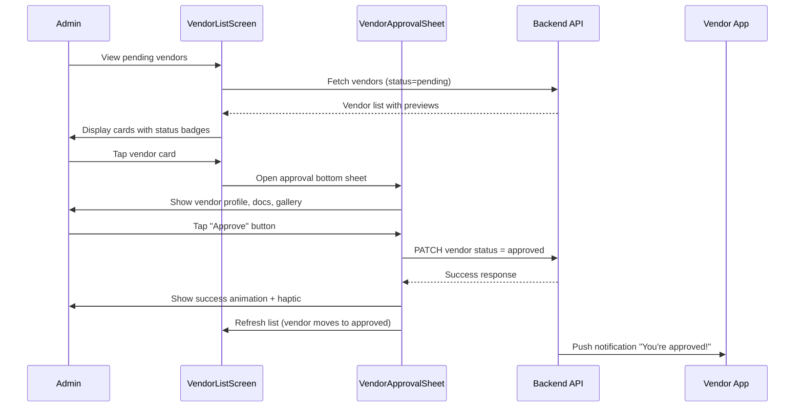
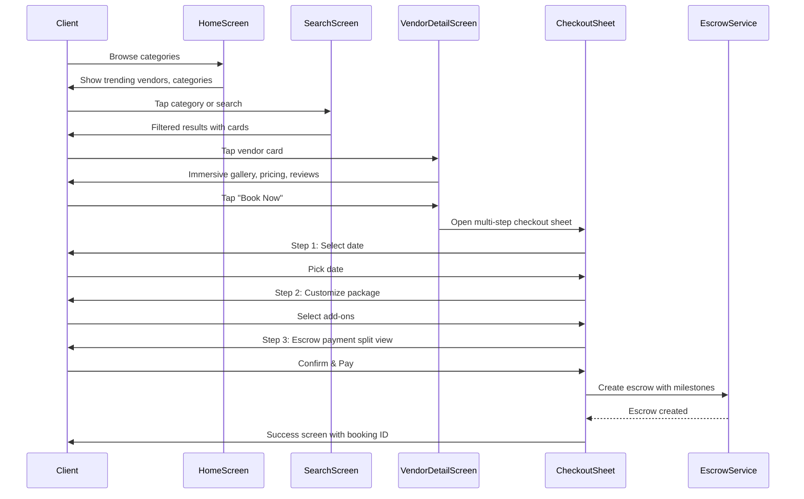

# Design Document: GoMandap UI/UX Redesign & Branding Overhaul

## Overview

This design document defines a comprehensive UI/UX redesign and branding overhaul for the GoMandap event management platform across all three applications: Admin, Vendor, and Client. The redesign establishes a unified, premium visual identity with a new logo system, refined color palette, consistent component library, and streamlined user experiences that feel high-end yet simple to navigate.

The platform currently uses Jetpack Compose (Android/Kotlin) for the Admin and Vendor apps, and Next.js for the web-based Client and Vendor portals. The redesign will create a shared design system that works across both native and web platforms, ensuring brand consistency while respecting platform-specific interaction patterns.

The core philosophy is "Luxury Simplicity" — every screen should feel premium and trustworthy while being immediately intuitive for Indian wedding and event planners, vendors, and clients.

## Architecture

### Design System Architecture



### Navigation Architecture Per App



## Components and Interfaces

### Component 1: Brand Identity System

**Purpose**: Establishes the visual identity of GoMandap across all touchpoints — logo, favicon, app icons, and splash screens.

**Interface**:
```kotlin
// Brand asset specifications
interface BrandIdentity {
    val logoFull: ImageVector        // Full "GoMandap" wordmark with icon
    val logoIcon: ImageVector        // Standalone icon (for favicon, app icon)
    val logoMonochrome: ImageVector  // Single-color variant for dark backgrounds
    val splashAnimation: LottieComposition  // Animated splash screen
}
```

**Logo Design Specification**:
- **Concept**: A stylized mandap (wedding canopy) silhouette integrated with the letter "G"
- **Style**: Geometric, minimal, modern — single continuous stroke forming both the mandap pillars and the G letterform
- **Primary Mark**: Champagne Gold gradient icon + "GoMandap" wordmark in Royal Navy
- **Favicon**: Simplified GoMandap icon at 32x32, 16x16 sizes
- **App Icon**: Rounded square with Royal Navy background, Champagne Gold GoMandap icon centered

**Responsibilities**:
- Provide consistent brand marks across all platforms
- Scale gracefully from 16px favicon to full-screen splash
- Work on both light and dark backgrounds

---

### Component 2: Refined Design Token System

**Purpose**: Centralizes all visual design decisions into a single source of truth shared across all three apps.

**Interface**:
```kotlin
object GomandapTokens {
    // ─── Color Palette (Refined) ─────────────────────────────────
    object Colors {
        // Primary
        val royalNavy = Color(0xFF0F172A)
        val royalNavyLight = Color(0xFF1E293B)
        val royalNavySurface = Color(0xFF334155)
        
        // Accent
        val champagneGold = Color(0xFFDFBA73)
        val champagneGoldLight = Color(0xFFF5E6C8)
        val champagneGoldDark = Color(0xFFC59A48)
        
        // Success / CTA
        val emeraldGreen = Color(0xFF10B981)
        val emeraldGreenLight = Color(0xFFD1FAE5)
        val emeraldGreenDark = Color(0xFF059669)
        
        // Neutrals
        val pearlWhite = Color(0xFFF8F9FA)
        val softMist = Color(0xFFF1F5F9)
        val slateGray = Color(0xFF64748B)
        val lightSlate = Color(0xFFE2E8F0)
        
        // Semantic
        val error = Color(0xFFEF4444)
        val errorLight = Color(0xFFFEE2E2)
        val warning = Color(0xFFF59E0B)
        val warningLight = Color(0xFFFEF3C7)
        val info = Color(0xFF3B82F6)
        val infoLight = Color(0xFFDBEAFE)
    }

    // ─── Typography Scale ────────────────────────────────────────
    object Typography {
        // Display: Splash, hero sections
        val displayLarge = TextStyle(fontSize = 36.sp, fontWeight = FontWeight.Black, letterSpacing = (-0.5).sp)
        val displayMedium = TextStyle(fontSize = 28.sp, fontWeight = FontWeight.Black, letterSpacing = (-0.25).sp)
        
        // Headings: Section titles, screen titles
        val headlineLarge = TextStyle(fontSize = 24.sp, fontWeight = FontWeight.Bold)
        val headlineMedium = TextStyle(fontSize = 20.sp, fontWeight = FontWeight.Bold)
        val headlineSmall = TextStyle(fontSize = 16.sp, fontWeight = FontWeight.SemiBold)
        
        // Body: Content, descriptions
        val bodyLarge = TextStyle(fontSize = 16.sp, fontWeight = FontWeight.Normal, lineHeight = 24.sp)
        val bodyMedium = TextStyle(fontSize = 14.sp, fontWeight = FontWeight.Normal, lineHeight = 20.sp)
        val bodySmall = TextStyle(fontSize = 12.sp, fontWeight = FontWeight.Normal, lineHeight = 16.sp)
        
        // Labels: Buttons, tags, badges
        val labelLarge = TextStyle(fontSize = 14.sp, fontWeight = FontWeight.SemiBold)
        val labelMedium = TextStyle(fontSize = 12.sp, fontWeight = FontWeight.Medium)
        val labelSmall = TextStyle(fontSize = 10.sp, fontWeight = FontWeight.Medium)
    }

    // ─── Spacing Scale ───────────────────────────────────────────
    object Spacing {
        val xxs = 4.dp
        val xs = 8.dp
        val sm = 12.dp
        val md = 16.dp
        val lg = 20.dp
        val xl = 24.dp
        val xxl = 32.dp
        val xxxl = 48.dp
    }

    // ─── Elevation & Shapes ──────────────────────────────────────
    object Elevation {
        val none = 0.dp
        val low = 1.dp
        val medium = 4.dp
        val high = 8.dp
        val overlay = 16.dp
    }

    object Shapes {
        val small = RoundedCornerShape(8.dp)
        val medium = RoundedCornerShape(12.dp)
        val large = RoundedCornerShape(16.dp)
        val extraLarge = RoundedCornerShape(24.dp)
        val pill = RoundedCornerShape(50)
    }
}
```

**Responsibilities**:
- Single source of truth for all visual values
- Enables consistent theming across Admin, Vendor, and Client apps
- Supports light mode (primary) with dark mode readiness

---

### Component 3: Core UI Component Library

**Purpose**: Reusable Jetpack Compose components that form the building blocks of all screens.

**Interface**:
```kotlin
// ─── Primary Button ──────────────────────────────────────────────
@Composable
fun GomandapButton(
    text: String,
    onClick: () -> Unit,
    modifier: Modifier = Modifier,
    variant: ButtonVariant = ButtonVariant.Primary,
    size: ButtonSize = ButtonSize.Medium,
    icon: ImageVector? = null,
    isLoading: Boolean = false,
    enabled: Boolean = true
)

enum class ButtonVariant { Primary, Secondary, Outline, Ghost, Danger }
enum class ButtonSize { Small, Medium, Large }

// ─── Card Component ──────────────────────────────────────────────
@Composable
fun GomandapCard(
    modifier: Modifier = Modifier,
    variant: CardVariant = CardVariant.Elevated,
    onClick: (() -> Unit)? = null,
    content: @Composable ColumnScope.() -> Unit
)

enum class CardVariant { Elevated, Outlined, Filled, Glass }

// ─── Input Field ─────────────────────────────────────────────────
@Composable
fun GomandapTextField(
    value: String,
    onValueChange: (String) -> Unit,
    label: String,
    modifier: Modifier = Modifier,
    placeholder: String = "",
    leadingIcon: ImageVector? = null,
    trailingIcon: ImageVector? = null,
    isError: Boolean = false,
    errorMessage: String? = null,
    keyboardType: KeyboardType = KeyboardType.Text
)

// ─── Status Badge ────────────────────────────────────────────────
@Composable
fun GomandapBadge(
    text: String,
    variant: BadgeVariant = BadgeVariant.Default,
    icon: ImageVector? = null
)

enum class BadgeVariant { Default, Success, Warning, Error, Info, Gold }

// ─── Bottom Navigation ───────────────────────────────────────────
@Composable
fun GomandapBottomNav(
    items: List<NavItem>,
    selectedIndex: Int,
    onItemSelected: (Int) -> Unit
)

// ─── Top App Bar ─────────────────────────────────────────────────
@Composable
fun GomandapTopBar(
    title: String,
    subtitle: String? = null,
    showBackButton: Boolean = false,
    onBack: (() -> Unit)? = null,
    actions: @Composable RowScope.() -> Unit = {}
)

// ─── Empty State ─────────────────────────────────────────────────
@Composable
fun GomandapEmptyState(
    icon: ImageVector,
    title: String,
    description: String,
    actionText: String? = null,
    onAction: (() -> Unit)? = null
)

// ─── Skeleton Loader ─────────────────────────────────────────────
@Composable
fun GomandapSkeleton(
    modifier: Modifier = Modifier,
    shape: Shape = GomandapTokens.Shapes.medium
)
```

**Responsibilities**:
- Provide consistent, accessible UI primitives
- Handle all interaction states (default, pressed, disabled, loading, error)
- Support haptic feedback on key interactions
- Animate with Material 3 motion curves

---

### Component 4: Domain-Specific Components

**Purpose**: Higher-level components specific to the event management domain, shared across apps where applicable.

**Interface**:
```kotlin
// ─── Vendor Card (Used in Admin list, Client search) ─────────────
@Composable
fun VendorCard(
    vendor: VendorSummary,
    variant: VendorCardVariant = VendorCardVariant.Standard,
    onTap: () -> Unit,
    onBookmark: (() -> Unit)? = null,
    onQuickAction: (() -> Unit)? = null
)

enum class VendorCardVariant { Standard, Compact, Featured, AdminReview }

// ─── Booking Status Card ─────────────────────────────────────────
@Composable
fun BookingStatusCard(
    booking: BookingSummary,
    onTap: () -> Unit,
    showEscrowProgress: Boolean = false
)

// ─── Escrow Progress Indicator ───────────────────────────────────
@Composable
fun EscrowProgressBar(
    milestones: List<EscrowMilestone>,
    currentMilestoneIndex: Int,
    totalAmount: Double
)

// ─── Stat Card (Admin/Vendor Dashboards) ─────────────────────────
@Composable
fun StatCard(
    title: String,
    value: String,
    subtitle: String? = null,
    trend: TrendDirection? = null,
    trendValue: String? = null,
    icon: ImageVector? = null,
    accentColor: Color = GomandapTokens.Colors.emeraldGreen
)

enum class TrendDirection { Up, Down, Neutral }

// ─── Calendar Availability Widget ────────────────────────────────
@Composable
fun AvailabilityCalendar(
    availableDates: Set<LocalDate>,
    bookedDates: Set<LocalDate>,
    highDemandDates: Set<LocalDate>,
    selectedDate: LocalDate?,
    onDateSelected: (LocalDate) -> Unit
)

// ─── Rating & Review Display ─────────────────────────────────────
@Composable
fun RatingDisplay(
    rating: Float,
    reviewCount: Int,
    variant: RatingVariant = RatingVariant.Compact
)

enum class RatingVariant { Compact, Expanded, Stars }
```

**Responsibilities**:
- Encapsulate complex domain UI patterns
- Maintain visual consistency for recurring data displays
- Handle loading, empty, and error states internally

---

### Component 5: Navigation & Layout System

**Purpose**: Defines the navigation patterns and screen layout structures for each app.

**Interface**:
```kotlin
// ─── App Shell (wraps each app) ──────────────────────────────────
@Composable
fun GomandapAppShell(
    appType: AppType,
    currentRoute: String,
    onNavigate: (String) -> Unit,
    content: @Composable () -> Unit
)

enum class AppType { Admin, Vendor, Client }

// ─── Screen Scaffold ─────────────────────────────────────────────
@Composable
fun GomandapScaffold(
    topBar: @Composable () -> Unit = {},
    bottomBar: @Composable () -> Unit = {},
    floatingActionButton: @Composable () -> Unit = {},
    snackbarHost: @Composable () -> Unit = {},
    content: @Composable (PaddingValues) -> Unit
)

// ─── Bottom Sheet Wrapper ────────────────────────────────────────
@Composable
fun GomandapBottomSheet(
    isVisible: Boolean,
    onDismiss: () -> Unit,
    title: String? = null,
    content: @Composable ColumnScope.() -> Unit
)
```

**Responsibilities**:
- Consistent navigation patterns per app type
- Admin: Side drawer + top bar (tablet-optimized)
- Vendor: Bottom navigation (5 tabs)
- Client: Bottom navigation (4 tabs) + contextual sheets

## Data Models

### Model 1: Design Token Configuration

```kotlin
data class ThemeConfig(
    val mode: ThemeMode = ThemeMode.Light,
    val brandAccent: Color = GomandapTokens.Colors.champagneGold,
    val primaryAction: Color = GomandapTokens.Colors.emeraldGreen,
    val fontScale: Float = 1.0f,
    val hapticEnabled: Boolean = true,
    val animationsEnabled: Boolean = true
)

enum class ThemeMode { Light, Dark, System }
```

**Validation Rules**:
- fontScale must be between 0.8 and 1.4
- Colors must meet WCAG AA contrast ratio (4.5:1 for text, 3:1 for large text)

### Model 2: Screen Layout Configuration

```kotlin
data class ScreenConfig(
    val appType: AppType,
    val screenName: String,
    val hasBottomNav: Boolean,
    val hasTopBar: Boolean,
    val topBarStyle: TopBarStyle,
    val contentPadding: PaddingValues,
    val scrollBehavior: ScrollBehavior
)

enum class TopBarStyle { Standard, Collapsing, Transparent, Branded }
enum class ScrollBehavior { Static, Scroll, NestedScroll }
```

**Validation Rules**:
- Admin screens always have TopBarStyle.Branded
- Client detail screens use TopBarStyle.Collapsing
- Bottom nav is hidden on auth/onboarding screens

### Model 3: Component State Model

```kotlin
data class ComponentState(
    val isLoading: Boolean = false,
    val isError: Boolean = false,
    val errorMessage: String? = null,
    val isEmpty: Boolean = false,
    val isRefreshing: Boolean = false
)
```

**Validation Rules**:
- isError and isLoading cannot both be true simultaneously
- errorMessage must be non-null when isError is true
- isEmpty is only evaluated when isLoading is false and isError is false

## Sequence Diagrams

### App Launch & Theming Flow



### Admin Vendor Approval Flow (Redesigned)



### Client Booking Flow (Redesigned)



## Correctness Properties

*A property is a characteristic or behavior that should hold true across all valid executions of a system — essentially, a formal statement about what the system should do. Properties serve as the bridge between human-readable specifications and machine-verifiable correctness guarantees.*

### Property 1: Color Contrast Compliance

*For any* text-background color pairing defined in the Design Token System, the computed contrast ratio SHALL be at least 4.5:1 for normal text (below 16sp) and at least 3:1 for large text (16sp and above) and UI components.

**Validates: Requirements 3.1, 3.2, 3.3**

### Property 2: Touch Target Minimum Size

*For any* interactive element (button, card, icon, toggle) rendered by the Component Library, the measured touch target area SHALL be at least 48dp × 48dp, regardless of the element's visual size.

**Validates: Requirements 4.1, 4.2**

### Property 3: Component State Validity

*For any* ComponentState instance, the following invariants SHALL hold: (1) isLoading and isError cannot both be true, (2) when isError is true then errorMessage is non-null, (3) when isLoading is true then isEmpty is not evaluated, and (4) state transitions follow Idle → Loading → Success|Error.

**Validates: Requirements 6.1, 6.2, 6.3, 6.4**

### Property 4: Navigation Graph Connectivity

*For any* screen reachable via the Navigation System, there SHALL exist a defined back-navigation path to a root screen, ensuring no dead-end screens exist in the navigation graph.

**Validates: Requirements 8.1**

### Property 5: Theme Token Completeness

*For any* screen composable in the Admin, Vendor, or Client app, all color, typography, spacing, and shape values used SHALL reference a defined token from GomandapTokens with no hardcoded visual values.

**Validates: Requirements 2.1, 2.2**

### Property 6: Cross-Platform Token Consistency

*For any* design token referenced across the Admin, Vendor, Client native apps, and web portals, the resolved value SHALL be identical when rendered on the same device or equivalent rendering context.

**Validates: Requirements 2.3, 16.2**

### Property 7: Responsive Layout Integrity

*For any* screen rendered at any device width between 320dp and 412dp, the layout SHALL produce no content overflow, clipping, or overlapping elements, using spacing tokens to maintain separation.

**Validates: Requirements 9.1, 9.3**

### Property 8: Font Scale Validation

*For any* font scale value provided to ThemeConfig, the system SHALL accept values in the range [0.8, 1.4] and reject values outside this range by defaulting to 1.0.

**Validates: Requirements 2.4, 2.5**

### Property 9: Empty State Coverage

*For any* list or data-driven screen with no content to display, the Component Library SHALL render a branded empty state containing an icon, title, description, and a contextual call-to-action when an actionable next step exists.

**Validates: Requirements 11.1, 11.2, 7.8**

### Property 10: Loading State Coverage

*For any* screen that fetches remote data, the Component Library SHALL display a skeleton loader or loading indicator during the fetch, never showing stale or undefined content while loading is in progress.

**Validates: Requirements 12.1, 12.2, 7.7**

### Property 11: Form Validation Feedback

*For any* form field that transitions from invalid to valid input, the Component Library SHALL clear the error message in real-time, and for any form submission with validation errors, inline error messages SHALL be displayed with scroll-to-first-error behavior.

**Validates: Requirements 13.5, 13.6**

### Property 12: Input Sanitization

*For any* text input containing potentially malicious content (script tags, SQL injection patterns, HTML entities), the Component Library SHALL sanitize the input before display to prevent injection attacks.

**Validates: Requirements 14.3**

### Property 13: Auth Screen Navigation Bar Hiding

*For any* authentication or onboarding screen in the navigation stack, the bottom navigation bar SHALL be hidden regardless of app type.

**Validates: Requirements 8.5**

### Property 14: Loading Button Non-Interactivity

*For any* button component in loading state, the component SHALL display a loading indicator and SHALL NOT respond to user interaction.

**Validates: Requirements 5.4**

### Property 15: Refresh State Content Preservation

*For any* screen undergoing a data refresh, the existing content SHALL remain visible while a refresh indicator is displayed, never hiding content during the refresh operation.

**Validates: Requirements 12.3**

## Error Handling

### Error Scenario 1: Network Failure

**Condition**: API calls fail due to connectivity issues
**Response**: Display inline error banner with retry action; preserve last-known data with "stale" indicator
**Recovery**: Automatic retry with exponential backoff; manual retry button; offline-capable screens show cached data

### Error Scenario 2: Authentication Expiry

**Condition**: Token expires during active session
**Response**: Transparent token refresh attempt; if refresh fails, show non-intrusive "Session expired" sheet
**Recovery**: Redirect to login with preserved navigation state; deep-link back after re-auth

### Error Scenario 3: Form Validation Failure

**Condition**: User submits invalid data in forms (onboarding, booking, vendor edit)
**Response**: Inline field-level error messages with red border highlight; scroll to first error
**Recovery**: Real-time validation clears errors as user corrects input; submit button stays disabled until valid

### Error Scenario 4: Empty States

**Condition**: Lists or searches return zero results
**Response**: Branded empty state illustration with contextual message and suggested action
**Recovery**: Provide clear CTA (e.g., "Adjust filters", "Add first vendor", "Browse all categories")

## Testing Strategy

### Unit Testing Approach

- Test all design token values for WCAG contrast compliance
- Test component state machines (loading → success, loading → error transitions)
- Test navigation route generation and deep-link parsing
- Snapshot tests for key component compositions at different states

### Property-Based Testing Approach

**Property Test Library**: Kotest (property-based testing for Kotlin)

- Color contrast ratios always meet WCAG AA for any token combination
- Typography scale maintains readable line heights at all font sizes
- Spacing values produce non-overlapping layouts for any content length
- Navigation state machine never reaches an invalid state

### Integration Testing Approach

- Compose UI tests for complete screen flows (login → dashboard)
- Screenshot comparison tests for visual regression across redesign
- Accessibility scanner tests (TalkBack compatibility, touch target sizes ≥ 48dp)
- Cross-app theme consistency validation (same tokens produce same visual output)

## Performance Considerations

- **Lazy Loading**: All list screens use LazyColumn/LazyRow with proper key management
- **Image Optimization**: Coil for async image loading with memory/disk caching and placeholder shimmer
- **Animation Budget**: Cap animations at 16ms frame budget; use `rememberInfiniteTransition` sparingly
- **Recomposition Minimization**: Use `remember`, `derivedStateOf`, and stable data classes to prevent unnecessary recompositions
- **Splash Screen**: Use Android 12+ SplashScreen API with vector drawable for instant cold-start branding
- **Theme Initialization**: Pre-compute all token values at app startup; avoid runtime color calculations

## Security Considerations

- **Sensitive Data Masking**: Escrow amounts and bank details partially masked by default; reveal on explicit tap
- **Screenshot Prevention**: Admin app sets `FLAG_SECURE` on screens showing vendor PII and financial data
- **Input Sanitization**: All text inputs sanitized before display to prevent injection in WebView components
- **Biometric Lock**: Optional biometric authentication for Admin app access (beyond login)

## Dependencies

| Dependency | Purpose | Version |
|---|---|---|
| Jetpack Compose BOM | UI framework | 2024.06.00+ |
| Material 3 | Design system foundation | 1.2.0+ |
| Compose Navigation | Screen routing | 2.7.0+ |
| Coil Compose | Image loading & caching | 2.6.0+ |
| Lottie Compose | Splash & micro-animations | 6.4.0+ |
| Accompanist | System UI controller, permissions | 0.34.0+ |
| Google Fonts (Outfit, Inter) | Typography | via downloadable fonts |
| Material Icons Extended | Icon set | latest |

## Implementation Plan

### Phase 1: Foundation (Week 1-2)
1. Create unified `common` module with design tokens, theme, and base components
2. Design and export logo/favicon/app icon assets (SVG → VectorDrawable)
3. Implement `GomandapTheme` composable with full token system
4. Build core component library (Button, Card, TextField, Badge, TopBar, BottomNav)

### Phase 2: Admin App Redesign (Week 3-4)
1. Apply new theme to existing Admin screens
2. Redesign Dashboard with refined stat cards and cleaner module navigation
3. Redesign Vendor management screens (list, approval, onboarding, edit)
4. Redesign CRM and Booking screens
5. Add branded splash screen and login redesign

### Phase 3: Vendor App Redesign (Week 4-5)
1. Apply new theme to Vendor app
2. Redesign login and onboarding flow with step indicators
3. Redesign vendor dashboard with earnings overview
4. Add booking management and calendar screens
5. Branded splash and app icon

### Phase 4: Client App Redesign (Week 5-7)
1. Apply new theme to Client app
2. Redesign home screen with refined category grid and trending sections
3. Redesign search and filter experience
4. Redesign vendor detail and booking checkout flow
5. Redesign escrow tracker and booking history
6. Branded splash, onboarding flow polish

### Phase 5: Web Parity & Polish (Week 7-8)
1. Port design tokens to CSS custom properties / Tailwind config for Next.js
2. Apply consistent branding to web Client and Vendor portals
3. Cross-platform visual QA and accessibility audit
4. Performance optimization pass (animation budgets, image sizes)
5. Final logo/favicon deployment across all platforms
