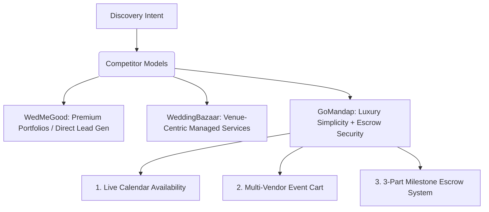
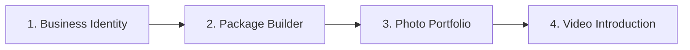
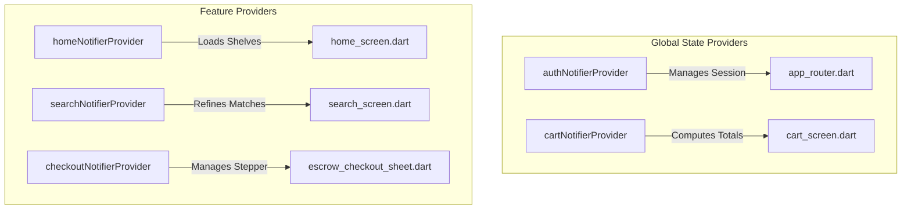

# GoMandap Client Panel & Vendor Ecosystem Specifications
## Comprehensive Platform Design · Competitor Benchmarking · 17-Category Deep-Dive · High-Fidelity UI/UX & Dynamic SVGs

> **Document Version:** 2.0.0 (Production Release)  
> **Target Platform:** Android & iOS (Flutter Multi-platform)  
> **Brand Design Philosophy:** *Luxury Simplicity*  
> **Primary Palette:** Royal Navy `#0F172A` · Emerald Green `#10B981` · Champagne Gold `#DFBA73 → #C59A48`

---

## 📖 Table of Contents

1. [Competitor Benchmarking (WedMeGood vs. WeddingBazaar vs. GoMandap)](#1-competitor-benchmarking)
2. [Universal 17-Category Directory & Deep Filters](#2-universal-17-category-directory--deep-filters)
3. [Animated Event Management Advertisement Cards & SVG Spec](#3-animated-event-management-advertisement-cards--svg-spec)
4. [Premium Client Panel UI/UX Spec & Micro-interactions](#4-premium-client-panel-uiux-spec--micro-interactions)
5. [High-Fidelity Vendor Onboarding Flow (Media Integrated)](#5-high-fidelity-vendor-onboarding-flow-media-integrated)
6. [E2E Data Models & Polymorphic Schema](#6-e2e-data-models--polymorphic-schema)
7. [App Navigation Graph & Riverpod States](#7-app-navigation-graph--riverpod-states)

---

## 1. Competitor Benchmarking

To build a best-in-class product, we benchmarked the market giants **WedMeGood** and **WeddingBazaar (formerly Weddingz)** against GoMandap's unique value proposition: **Milestone-Based Escrow Protection**.



### Competitor Feature Comparison

| Feature | WedMeGood 🌸 | WeddingBazaar 🏛 | GoMandap (Our Platform) 🛡 |
| :--- | :--- | :--- | :--- |
| **Monetization** | Paid listings & lead commissions | Venue booking commissions | 2% Platform Escrow fee |
| **Trust Model** | User reviews & rating tags | Managed-venue verified lists | **Partner Bank Escrow Account holding funds** |
| **Availability** | Manual contact required | Phone coordinator assistance | **Live 3-State Interactive Calendar** |
| **Add-on Customizer** | None (Static packages) | Standard venue quotes | **Interactive Counter Stepper & Add-on Cart** |
| **Dispute Resolution** | None (Direct dispute) | Manual support resolution | **Escrow Lock & Direct Arbitrated Dispute Portal** |

### 🚀 GoMandap Improvements:
* **The "Key Insights" Panel:** Drawing from WedMeGood's review cards, we extract high-sentiment keywords (e.g., *"Best in Budget"*, *"Flawless Audio"*) and place them as verified trust tags on listings.
* **The "Why Choose Us" Panel:** Showcases the vendor's years in business, total successful events, and verified platform bookings.
* **Single Event Checkout:** Unlike competitors where you must negotiate with 5 separate vendors, GoMandap lets you add a Venue, Caterer, DJ, and Decorator to a single **Multi-Vendor Event Cart** and lock them with one unified Escrow transaction.

---

## 2. Universal 17-Category Directory & Deep Filters

GoMandap supports all **17 critical wedding and event categories**. Below is the polymorphic schema, primary calls-to-action (CTA), and specialized deep filters for each:

```
Categories:
├── 1. Venues (Banquet Halls, Open Lawns, Resorts, Kalyana Mandapams)
├── 2. Photography (Pre-wedding, Candid, Cinematic, Drone)
├── 3. Bridal Makeup (Airbrush, HD, Hair Styling, Draping)
├── 4. Decor / Mandap (Floral, Acrylic, Royal, Traditional, Boho)
├── 5. Catering (Veg/Non-Veg, Buffet, Banana Leaf, Live Counters)
├── 6. Mehndi Artists (Bridal, Arabic, Traditional, Indo-Western)
├── 7. Invitations (E-cards, Luxury Scrolls, Boxed Invites, Printing)
├── 8. Jewellery (Temple, Kundan, Polki, Gold, Diamond Sets)
├── 9. DJ & Live Music (Sound, Laser Lights, Live Bands, Folk Artists)
├── 10. Bridal Wear / Groom Wear (Lehengas, Sarees, Gowns, Sherwanis)
├── 11. Wedding Cars (Luxury Sedans, Convertibles, Vintage Cars)
├── 12. Entertainment (Performers, Magicians, Fire Dancers, Live Acts)
├── 13. Choreographers (Sangeet, Flash mobs, Couple entry)
├── 14. Gifts & Favors (Personalized Hampers, Potlis, Sweets boxes)
├── 15. Pandits (Vedic Pujas, Homams, Multi-lingual Priests)
├── 16. Honeymoon Travel (Domestic, International, Custom Itineraries)
└── 17. Wedding Planners (Full execution, Day-of coordination, Decor planners)
```

### Category Polymorphic Configurations

| # | Category | Icon / Hero Motif | Primary CTA | Deep Filters | Custom Fields |
| :--- | :--- | :--- | :--- | :--- | :--- |
| **1** | **Venues** | `Icons.apartment` | Check Availability | Capacity, Budget/Plate, AC, Parking, Rooms | Guest Capacity, Room Count, Parking bays, AC status |
| **2** | **Photography** | `Icons.camera_alt` | View Portfolio | Cinematic, Candid, Drone, Package Price | Team size, Camera specs, Raw footage policy, Delivery time |
| **3** | **Bridal Makeup** | `Icons.face` | Book Trial | Airbrush, HD, Hair styling, Brands (MAC, Huda) | Brand list, Trial fee, Draping support (Yes/No) |
| **4** | **Decor / Mandap** | `Icons.local_florist` | Request Quote | Theme (Floral, Royal, Boho), Setup location | Setup hours, Tear-down speed, Floral grade |
| **5** | **Catering** | `Icons.restaurant` | Request Menu | Veg/Non-Veg, Cuisine (South, North, Asian) | Minimum guests, live counters, welcome drinks, sweets |
| **6** | **Mehndi Artists** | `Icons.brush` | View Portfolio | Traditional, Arabic, Hand Count, Budget | Bridal package price, hand price, team size |
| **7** | **Invitations** | `Icons.mail` | Request Sample | E-card, Boxed, Printing type (Foil, Letterpress) | Minimum order count, shipping days, custom box fee |
| **8** | **Jewellery** | `Icons.diamond` | View Collection | Temple, Kundan, Gold, Diamond, Rent/Buy | Hallmarked status, security deposit (for rentals), return days |
| **9** | **DJ & Live Music** | `Icons.music_note` | Request Demo | Genre, sound setup, laser lights, performance hours | Decibels level, travel cost, backup systems |
| **10** | **Bridal Wear** | `Icons.checkroom` | Book Fitting | Lehenga, Gown, Sherwani, Custom Tailored | Customization weeks, alteration loops, trial policy |
| **11** | **Wedding Cars** | `Icons.directions_car` | Check Package | Luxury, Convertible, Vintage, Hours, Chauffeur | Chauffeur uniform, mileage limit, decoration include |
| **12** | **Entertainment** | `Icons.star` | Request Demo | Fire show, Magician, Live singers, Guest count | AV sound setup need, stage dimension requirement, performance rounds |
| **13** | **Choreographers** | `Icons.accessibility` | Book Session | Sangeet, Bollywood, Folk, Number of practices | Practice session count, backup dancers, track editing |
| **14** | **Gifts & Favors** | `Icons.card_giftcard` | Customize Order | Boxed hampers, custom potlis, eco-friendly favors | Logo printing support, batch shipping cost, lead time |
| **15** | **Pandits** | `Icons.wb_sunny` | Check Availability | Languages (Telugu, Tamil, Hindi), Ritual types | Havan samagri include (Yes/No), assistant priests, travel |
| **16** | **Honeymoon** | `Icons.flight` | View Itinerary | Domestic, International, Travel style, Stay rating | Flight inclusion, transfers, customized sightseeing itinerary |
| **17** | **Wedding Planners** | `Icons.assignment` | Request Consult | Event size, Full / Partial planning, Coordination | Team lead ratio, vendor contacts sheet, logistics software |

---

## 3. Animated Event Management Advertisement Cards & SVG Spec

To create visual wonder, the homepage features interactive **Event Management Sponsorship Cards** that feature **live animated vector SVGs**. These advertisements promote our premium Event Planning Partner: *GoMandap Elite Events*.

```
+-------------------------------------------------------------+
|  GoMandap Elite Events                               [Ad]   |
|  "Crafting Royal Memories"                                 |
|                                                             |
|  [ Animated Vector SVG Canvas ]                             |
|  * Sangeet Dancers rotating dynamically                     |
|  * Sparklers flashing with HSL glowing gradients            |
|  * Stage Mandap rising/opening smoothly                      |
|                                                             |
|  Get 25% Off Full Sangeet Planning      [Book Consult 👑]   |
+-------------------------------------------------------------+
```

### High-Fidelity SVG Code Specs (Flutter Vector Asset)

The SVG is directly embedded into the card and animated using native Flutter transitions (or HTML5 keyframes when running on web):

```xml
<svg xmlns="http://www.w3.org/2000/svg" viewBox="0 0 400 200" width="100%" height="100%">
  <!-- Definitions for luxury gold gradients -->
  <defs>
    <linearGradient id="goldGrad" x1="0%" y1="0%" x2="100%" y2="100%">
      <stop offset="0%" stop-color="#DFBA73" />
      <stop offset="50%" stop-color="#F3E5AB" />
      <stop offset="100%" stop-color="#C59A48" />
    </linearGradient>
    <filter id="glow">
      <feGaussianBlur stdDeviation="3" result="coloredBlur"/>
      <feMerge>
        <feMergeNode in="coloredBlur"/>
        <feMergeNode in="SourceGraphic"/>
      </feMerge>
    </filter>
  </defs>

  <!-- Background Canvas -->
  <rect width="100%" height="100%" fill="#0F172A" rx="16" />

  <!-- Animated Mandap Pillars -->
  <g class="mandap" transform="translate(0, 10)">
    <rect x="60" y="40" width="12" height="140" fill="url(#goldGrad)" opacity="0.8">
      <animate attributeName="height" values="0;140" dur="1.5s" repeatCount="1" fill="freeze" />
    </rect>
    <rect x="328" y="40" width="12" height="140" fill="url(#goldGrad)" opacity="0.8">
      <animate attributeName="height" values="0;140" dur="1.5s" repeatCount="1" fill="freeze" />
    </rect>
    <!-- Dome Arch -->
    <path d="M 60 40 Q 200 -20 340 40" fill="none" stroke="url(#goldGrad)" stroke-width="6" filter="url(#glow)">
      <animate attributeName="stroke-dasharray" values="0,1000;1000,0" dur="2s" repeatCount="1" fill="freeze" />
    </path>
  </g>

  <!-- Animated Dancers Silhouette -->
  <g class="dancers" transform="translate(200, 110) scale(0.9)">
    <!-- Bride Silhouette -->
    <path d="M -20 50 Q -10 10 0 0 Q 10 10 20 50 Z" fill="#10B981" opacity="0.85">
      <animateTransform attributeName="transform" type="rotate" values="-5 0 25; 5 0 25; -5 0 25" dur="3s" repeatCount="indefinite" />
    </path>
    <!-- Groom Silhouette -->
    <path d="M -5 50 L -5 10 L 5 10 L 5 50 Z" fill="#DFBA73" opacity="0.9">
      <animateTransform attributeName="transform" type="translate" values="0 0; 0 -4; 0 0" dur="1.5s" repeatCount="indefinite" />
    </path>
  </g>

  <!-- Animated Flashing Sparklers -->
  <g class="sparklers">
    <circle cx="90" cy="80" r="3" fill="#FFF" filter="url(#glow)">
      <animate attributeName="opacity" values="0.2;1.0;0.2" dur="0.8s" repeatCount="indefinite" />
      <animate attributeName="r" values="2;5;2" dur="0.8s" repeatCount="indefinite" />
    </circle>
    <circle cx="310" cy="80" r="3" fill="#FFF" filter="url(#glow)">
      <animate attributeName="opacity" values="1.0;0.2;1.0" dur="0.8s" repeatCount="indefinite" />
      <animate attributeName="r" values="5;2;5" dur="0.8s" repeatCount="indefinite" />
    </circle>
  </g>
</svg>
```

---

## 4. Premium Client Panel UI/UX Spec & Micro-interactions

To provide an elite *Luxury Simplicity* experience, the application uses advanced frontend parameters:

### A. Dynamic Parallax Layers
The detail screens and category screens employ horizontal and vertical **3D Parallax Scrolling**. When scrolling through cities or venues:
* Foreground cards slide at a **1.0x scroll factor**.
* Background photography slices slide at a **0.65x scroll factor**, shifting boundaries without clipping card borders.

### B. Glassmorphism Tokens
We use frosted glass properties across all floating overlays, search fields, and detail page action bars:
* **Background Opacity:** `Colors.white.withValues(alpha: 0.85)`
* **Gaussian Blur Radius:** `BackdropFilter(filter: ImageFilter.blur(sigmaX: 12, sigmaY: 12))`
* **Frosted Borders:** `Border.all(color: Colors.white.withValues(alpha: 0.4), width: 1.5)`
* **Shadow Fills:** Subtle outer drop shadows using HSL-based gray opacity (`0.06`).

### C. Spring Animation Specifications
No stiff linear transitions are allowed. All chip updates, calendar selections, and FAB spring-ins use spring-physics models:
* **Spring Constant (Tension):** `180`
* **Damping Ratio (Friction):** `0.72` (produces a subtle organic bounce on selection scale changes `1.0 → 1.05 → 1.0`).

---

## 5. High-Fidelity Vendor Onboarding Flow (Media Integrated)

To ensure high-quality vendor supply, the **Vendor Onboarding Portal** is designed as a rigorous, premium **4-Step Media-Integrated Wizard**:



### Step 1: Business Identity & Profile Setup
* **Fields:** Registered Business Name, Locality, City Selection, GSTIN (optional), Operating Category, Business Overview Text.
* **UX Rule:** Real-time character count limits on description (min 200, max 2000 characters) to ensure high-quality, readable business pages.

### Step 2: Custom Milestone Package Builder
* Vendors define their base rates and milestones:
  * **Veg Plate Price / Base Package Price**
  * **Cancellation Refund Policy:** (Non-Refundable / 50% Refundable / Flexible)
  * **Milestone Releases:** Customizable part releases (e.g. standard 25%-50%-25%).

### Step 3: Immersive Portfolio Uploads (Multi-Image)
* **Features:** Drag-and-drop horizontal grid allowing uploading **up to 12 high-resolution photos**.
* **Validation Rules:**
  * Minimum resolution: `1920 x 1080` (Full HD).
  * Allowed formats: `PNG`, `JPEG`, `WEBP` (Max size: `10MB` per image).
  * **Automatic Client Compress:** High-performance local resizing to web-optimized formats before upload to secure cloud vaults.

### Step 4: High-Fidelity Video Introduction (Pre-Event Pitch)
* **The Pitch:** Vendors upload a **60-second video introduction** or walk-through of their facilities.
* **Technical Constraints:**
  * Supported formats: `MP4`, `MOV`.
  * Maximum duration: **60 seconds** (Strictly client-side validated).
  * Maximum file size: `50MB`.
  * **Transcoding Spec:** Transcoded to web-optimized `H.264` format with progressive streaming tags on cloud ingestion.
  * **UX Flow:** Interactive custom video player showing a playback preview prior to final submission.

---

## 6. E2E Data Models & Polymorphic Schema

The application database schema leverages a polymorphic layout to represent different categories cleanly under a unified database model.

### Unified Vendor Model
```dart
class VendorModel {
  final String id;
  final String name;
  final String category;       // e.g., "Venue", "Catering"
  final String city;
  final String locality;
  final double rating;
  final int reviewCount;
  final double price;          // Base pricing threshold
  final String priceLabel;     // "per plate", "per day", "package"
  final List<String> galleryUrls;
  final String? videoUrl;      // Transcoded 60s intro video
  final bool isVerified;
  final bool isEscrowProtected;
  
  // Dynamic category details
  final Map<String, dynamic> categoryAttributes;

  const VendorModel({
    required this.id,
    required this.name,
    required this.category,
    required this.city,
    required this.locality,
    required this.rating,
    required this.reviewCount,
    required this.price,
    required this.priceLabel,
    required this.galleryUrls,
    this.videoUrl,
    this.isVerified = true,
    this.isEscrowProtected = true,
    required this.categoryAttributes,
  });
}
```

### Escrow Booking Model
```dart
class BookingModel {
  final String id;
  final String vendorId;
  final String vendorName;
  final String category;
  final DateTime eventDate;
  final int guestCount;
  final double totalAmount;
  final double platformFee;
  final String status; // 'pending', 'confirmed', 'completed', 'cancelled'
  final List<MilestoneModel> milestones;
  final DateTime createdAt;

  const BookingModel({
    required this.id,
    required this.vendorId,
    required this.vendorName,
    required this.category,
    required this.eventDate,
    required this.guestCount,
    required this.totalAmount,
    required this.platformFee,
    required this.status,
    required this.milestones,
    required this.createdAt,
  });
}

class MilestoneModel {
  final String label;
  final double percentage;
  final double amount;
  final String status; // 'Released', 'Held', 'Locked'
  final String trigger;

  const MilestoneModel({
    required this.label,
    required this.percentage,
    required this.amount,
    required this.status,
    required this.trigger,
  });
}
```

---

## 7. App Navigation Graph & Riverpod States

The multi-page router handles smooth full-bleed animations and manages localized scopes using Riverpod.

### Route Map (GoRouter)
* `/login` - Phone OTP authentication.
* `/home` - Dynamic home dashboard with horizontal scrolls, event banners, and parallax cities.
* `/search` - Dynamic search feed with sticky `OmniFilterBar` and `DeepFilterSheet`.
* `/vendor/:id` - Dynamic vendor spec panels, Availability calendars, and rating cards.
* `/cart` - Multi-vendor booking event cart with real-time totalizers.
* `/checkout` - Multi-step `EscrowCheckoutScreen` progress stages.
* `/bookings` - Confirmed timeline logs.
* `/booking/:id` - Detailed booking records with inline chat buttons.
* `/escrow/:bookingId` - Vertical visual milestone trackers and release portals.
* `/profile` - Accounts overview.

### Active Riverpod State Providers



* **`authNotifierProvider`:** Handles user login status, SMS confirmation codes, and onboarding state.
* **`homeNotifierProvider`:** Manages loaded city directories, trending lists, and carousel indices.
* **`searchNotifierProvider`:** Filters matching arrays, sorting orders, and updates active chips count.
* **`checkoutNotifierProvider`:** Monitors current stage index, guest capacity steppers, and processes transaction triggers.
* **`cartNotifierProvider`:** Manages selected item rows, swipe deletion locks, and syncs updates globally.
