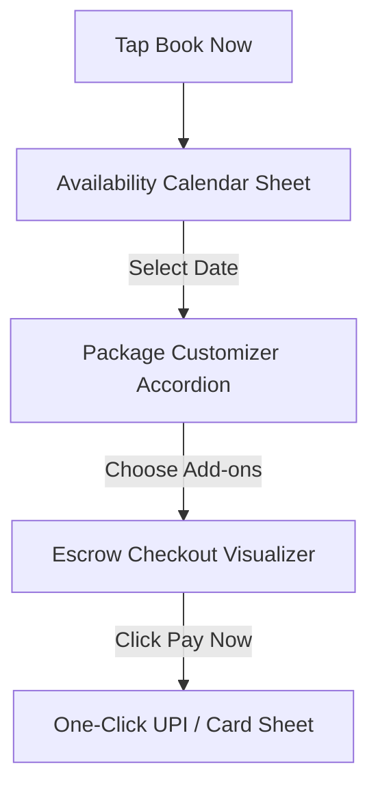
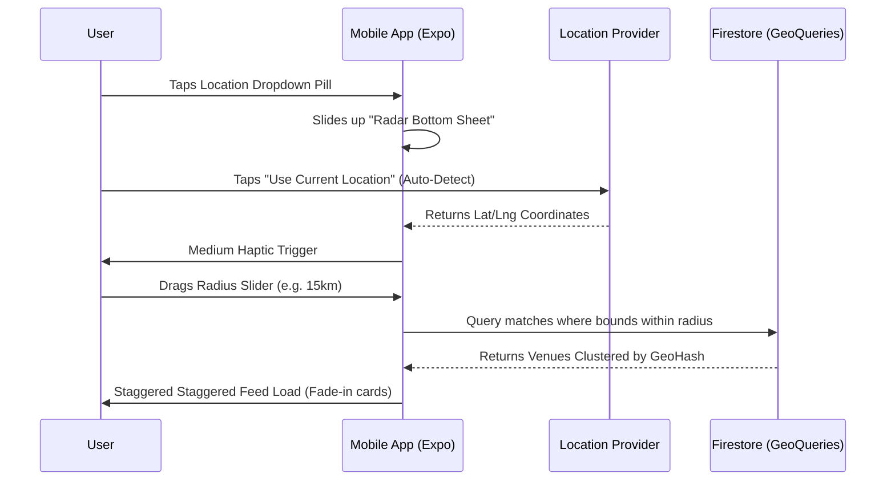

# GoMandap Premium UX/UI & Mobile Interaction Specification

Welcome to the **GoMandap Principal UX/UI Design & Mobile Interaction Blueprint**. As a Principal UX/UI Designer and Mobile Interaction Expert, I have created this specification to establish a cohesive, modern visual language. The design blends visual luxury with high-efficiency direct conversions, utilizing a robust visual DNA, a portrait-locked mobile layout, native advertising engines, and clear escrow models.

---

## 🎨 Visual DNA & Design System

The visual language of GoMandap is designed to feel highly trustworthy, premium, and celebratory. It is styled in a luxury dark-mode concept with bright organic surfaces and metallic gradients.

### 1. Harmonious Color Palette (HSL & Hex)
* **Primary Luxury (Royal Navy):** `hsl(222, 47%, 11%)` (`#0F172A`) — Evokes trust, security, and premium quality.
* **Secondary Action (Emerald Green):** `hsl(142, 71%, 45%)` (`#10B981`) — Represents growth, verification, and successful transaction releases.
* **Celebratory Accents (Champagne Gold):** `linear-gradient(135deg, #DFBA73 0%, #C59A48 100%)` — Brings weddings, festivals, and exclusivity to life.
* **Neutral Backgrounds (Pearl White / Ice-Cream Gray):** `hsl(0, 0%, 98%)` (`#F8F9FA`) / `hsl(45, 100%, 99%)` (`#FBFAEE`) — Provides a bright canvas that makes high-resolution photography stand out.

### 2. Typography & Motion Curves
* **Primary Fonts:** *Outfit* (for bold, elegant headings) & *Inter* (for highly legible body details and price labels).
* **Easing Curve (Material 3 Emphasized):** `cubic-bezier(0.2, 0.0, 0.0, 1.0)` — Fluid, responsive transitions that mimic real physical deceleration.
* **Haptic Signature:** Standardized vibration clicks using distinct frequency durations (5ms light ticks for filters, 30ms double-taps for cart success, and 50ms firm bumps for checkout confirmations).

---

## 🏰 Visual Mockup Previews

Here are high-fidelity mockups demonstrating the visual DNA and layout structures designed for this application:

### Home Screen Interface Mockup


### Escrow Booking Checkout Flow Mockup


---

## 1. The Home Screen Component Architecture

Designed for one-handed thumb-reach optimization (all interactive points are clustered within the lower 60% of the display).

### 📐 Component Stack (Top-to-Bottom)
1. **[Persistent Top Navigation Bar]** (Height: 56dp)
   * Left: App Brand Logo with subtle champagne shimmer.
   * Right: [Cart/Basket Icon] with a circular red badge counter and [User Profile Circle].
2. **[Hero Ad Carousel (Auto-playing Banners)]** (Aspect Ratio: 16:9)
   * Swipeable horizontal viewport displaying sponsored luxury halls.
   * Indicators: Soft champagne dot array pinned to the bottom-center.
3. **[Sticky Floating Search & Filter Bar]** (Height: 48dp, 16dp margins)
   * Styled with a glassmorphic blur (`backdrop-filter: blur(12px)`) and a light gold border.
   * Internal layout: `[Search Icon] -> "Search Banquets, Resorts..." -> [Vertical Divider] -> [Date/Location Selectors]`.
4. **[Category Super-Grid Selection Matrix]** (2 Rows x 4 Columns)
   * Standardized circular layout:
     * BANQUETS | OPEN LAWNS | CATERING | DECORATORS
     * PHOTOGRAPHY | MAKEUP | DJ ENTERTAINMENT | MORE
   * Interaction: Tapping any item slides up a context-aware **Intelligent Bottom Sheet** instead of redirecting the user to a new screen.
5. **[Horizontal Scroll Shelf: Trending Venues]** (Height: 310dp)
   * Left-snapping container displaying cards.
   * Every 4th card in this feed is an **Interspersed Native Ad Card** with a gold champagne glowing border and a top-right corner `[Sponsored]` badge.
6. **[Category-Specific Banner Injection]** (Height: 110dp)
   * Static full-width banner advertising e.g. "Exclusive Summer Deals on Caterers".
7. **[Horizontal Scroll Shelf: Elite Services]** (Height: 280dp)
   * Snap-scroll row displaying service card selections (Photographers, DJs).

---

## 2. Venue Detail Screen Component Architecture

A highly immersive layout designed to guide users from initial discovery to instant conversion.

### 📐 Component Stack (Top-to-Bottom)
1. **[Immersive Image Gallery Header]** (Height: 450dp, Full-bleed)
   * Bottom overlay displays a horizontal indicator pill `(1/12 photos)`.
   * Floating overlay elements:
     * Top-Left: Glassmorphic [Back Chevron Button] (36x36dp hit-box).
     * Top-Right: Glassmorphic [Share Button] + [Heart/Save Button] (toggles red with haptic pop).
2. **[Overview Panel Block]** (16dp margins, background card styled in pure white)
   * Row 1: `[Business Name Label]` (e.g. "The Heritage Gala Resort") + `[Verified Diamond Badge]`.
   * Row 2: `[Star Rating Badge] (e.g. 4.9 ★)` + `[Locality string] (e.g. Jubilee Hills, Hyderabad)`.
   * Row 3: HSL character pills (e.g., `Max 1500 Guests`, `AC Banquet`, `Valet Parking`).
3. **[Availability Calendar Inline Widget]**
   * Shows a compact preview of the active month with quick-reserve slots.
4. **[Rich Specifications Description Block]**
   * Accordion-style sections detailing:
     * About the Venue
     * Dynamic Amenities Checklist
     * Food & Alcohol Packages
5. **[Verified Review Panel]**
   * Displays only customer reviews flagged as `Verified Bookings`.
6. **[Sticky Bottom Action Bar]** (Persistent overlay, Height: 72dp)
   * Left: Price details `Starting at ₹1,500/plate`.
   * Right: Bright Emerald Green **"Book Now"** primary button (haptic-bound on touch down).

---

## 3. Direct Booking Checkout Flow (The Core Conversion Loop)

Designed as a single, multi-stage bottom-sheet flow to maximize user retention and prevent drop-offs.



### Step 1: Vertical Availability Calendar
* **Visual Components:**
  * Clean, infinite-scrolling vertical grid showing dates.
  * *State Indication:*
    * **Unavailable Dates:** Grayed out with a subtle diagonal strikethrough.
    * **High-Demand Dates:** Overlayed with a tiny gold "Filling Fast" badge.
    * **Selected Date:** Highlighted in active Emerald Green with a soft shadow circle.
* **Gestures:** Vertical swipe scrolls months; tap selects date.

### Step 2: Package Customizer (Accordion System)
* **Visual Components:**
  * Vertically stacked collapsing accordions (Catering, Decoration, AV Production).
  * Checkboxes and counter-selectors (e.g., `Veg plates: [ - ] 250 [ + ]`).
  * Persistent dynamic summary footer displaying real-time calculations: `Total: ₹3,25,000`.

### Step 3: Escrow Checkout Visualizer
* **Visual Components:**
  * High-trust visual timeline showing progress milestones:
    ```
    (🟢 Node 1: Booking Lock) --------- (🟡 Node 2: Pre-Event) --------- (🔴 Node 3: Final Handover)
           20% (₹65,000)                      50% (₹1,62,500)                    30% (₹97,500)
       Released Immediately                Held Securely in Escrow           Released Post-Event
    ```
  * Brief explanation text: *"Funds are secured by GoMandap Escrow and only released when milestones are verified."*

### Step 4: One-Click Payment Gateway Integration
* **Visual Components:**
  * Clean slide-up sheet displaying active payment methods (UPI, saved Credit/Debit Cards, NetBanking).
  * Tapping "Pay Securely" fires the payment gateway, displaying a shimmering green transaction spinner.

---

## 4. State Management Logic & ViewState Models

The application manages visual states cleanly via MVI, ensuring instant updates across the multi-category basket.

### MVI ViewState Mapping
```kotlin
// Main visual UI state models representation
data class HomeUiState(
    val selectedCity: String = "Hyderabad",
    val searchQuery: String = "",
    val activeCarouselIndex: Int = 0,
    val selectedCategory: String? = null,
    
    // Bottom Sheet states
    val isCategorySheetOpen: Boolean = false,
    val activeCategoryQuestions: List<Question> = emptyList(),
    
    // Unified Multi-Category Cart state
    val crossCategoryCart: Cart = Cart(venues = emptyList(), services = emptyList()),
    
    // Feeds and lists
    val isLoading: Boolean = false,
    val listings: List<ListingItem> = emptyList()
)

data class Cart(
    val venues: List<VenueBooking>,
    val services: List<ServiceBooking>
) {
    val totalAmount: Double
        get() = venues.sumOf { it.price } + services.sumOf { it.price }
}
```

### State-Machine Transitions
1. `SelectCategory(category)` -> Triggers haptic click -> Sets `selectedCategory` -> Loads customized questionnaire -> Sets `isCategorySheetOpen = true`.
2. `ToggleSavedVenue(venueId)` -> Triggers haptic pop -> Updates locally cached database row -> Sets saved icon state in real-time.
3. `AddVenueToCart(venue)` -> Updates `crossCategoryCart` -> Flashes the top-bar basket badge counter -> Synthesizes checkmark indicator bindings.

---

## 🏰 Visual Mockup Expansion (Next-Gen UI & Cities)


---

## 5. React Native Advanced Listing Card Architecture

The next-generation Listing Card operates as a self-contained micro-application utilizing React Native Reanimated, handling inline image paging, long-press video pre-rendering, and Firestore real-time indicator synchronization.

### 📐 Component Structure & State Props (Typescript / Expo)

```typescript
import React, { useState, useRef } from 'react';
import { View, Text, Pressable, StyleSheet, Dimensions } from 'react-native';
import Animated, { useSharedValue, useAnimatedStyle, withSpring } from 'react-native-reanimated';
import { Video, ResizeMode } from 'expo-av';
import { Ionicons } from '@expo/vector-icons';

interface AdvancedCardProps {
  id: string;
  businessName: string;
  locality: string;
  rating: number;
  images: string[];
  videoUrl?: string;
  basePlatePrice: number;
  packagePrice: number;
  isEscrowProtected: boolean;
  isFastFilling: boolean;
  onBookNow: () => void;
  onChatPress: () => void;
  onShortlistToggle: () => void;
}

export const AdvancedListingCard: React.FC<AdvancedCardProps> = ({
  images,
  businessName,
  locality,
  rating,
  videoUrl,
  basePlatePrice,
  packagePrice,
  isEscrowProtected,
  isFastFilling,
  onBookNow,
  onChatPress,
  onShortlistToggle,
}) => {
  const [activeImageIndex, setActiveImageIndex] = useState(0);
  const [isLongPressing, setIsLongPressing] = useState(false);
  const [isPerPlate, setIsPerPlate] = useState(true);
  
  const scale = useSharedValue(1);

  const cardAnimatedStyle = useAnimatedStyle(() => ({
    transform: [{ scale: scale.value }],
  }));

  const handlePressIn = () => {
    scale.value = withSpring(0.97);
  };

  const handlePressOut = () => {
    scale.value = withSpring(1);
    setIsLongPressing(false);
  };

  return (
    <Animated.View style={[styles.card, cardAnimatedStyle]}>
      {/* 1. Inline Swipe Carousel / Long-Press Video */}
      <Pressable 
        onPressIn={handlePressIn}
        onPressOut={handlePressOut}
        onLongPress={() => setIsLongPressing(true)}
        delayLongPress={600}
        style={styles.mediaContainer}
      >
        {isLongPressing && videoUrl ? (
          <Video
            source={{ uri: videoUrl }}
            rate={1.0}
            volume={0.0}
            isMuted={true}
            resizeMode={ResizeMode.COVER}
            shouldPlay
            isLooping
            style={styles.videoPlayer}
          />
        ) : (
          <Animated.Image 
            source={{ uri: images[activeImageIndex] }} 
            style={styles.mediaImage} 
          />
        )}

        {/* Floating Trust Badges */}
        <View style={styles.badgeContainer}>
          {isEscrowProtected && (
            <View style={[styles.badge, styles.escrowBadge]}>
              <Ionicons name="shield-checkmark" size={12} color="#10B981" />
              <Text style={styles.badgeText}>Escrow Guard</Text>
            </View>
          )}
          {isFastFilling && (
            <View style={[styles.badge, styles.fillingBadge]}>
              <Text style={styles.badgeTextGold}>🔥 FILLING FAST</Text>
            </View>
          )}
        </View>
      </Pressable>

      {/* 2. Overview Info Block */}
      <View style={styles.detailsContainer}>
        <View style={styles.headerRow}>
          <Text style={styles.titleText}>{businessName}</Text>
          <View style={styles.ratingRow}>
            <Ionicons name="star" size={14} color="#DFBA73" />
            <Text style={styles.ratingText}>{rating}</Text>
          </View>
        </View>
        <Text style={styles.localityText}>{locality}</Text>

        {/* 3. Contextual Pricing Toggle */}
        <View style={styles.pricingRow}>
          <View>
            <Text style={styles.priceText}>
              ₹{isPerPlate ? basePlatePrice.toLocaleString('en-IN') : packagePrice.toLocaleString('en-IN')}
            </Text>
            <Text style={styles.priceSubText}>{isPerPlate ? 'Per Plate Starting' : 'Total Base Package'}</Text>
          </View>
          <Pressable 
            onPress={() => setIsPerPlate(!isPerPlate)} 
            style={styles.toggleButton}
          >
            <Text style={styles.toggleText}>{isPerPlate ? 'Show Package' : 'Show Plate'}</Text>
          </Pressable>
        </View>

        {/* 4. Quick Action Footer */}
        <View style={styles.footerRow}>
          <View style={styles.iconActions}>
            <Pressable onPress={onChatPress} style={styles.iconButton}>
              <Ionicons name="chatbubble-ellipses-outline" size={20} color="#0F172A" />
            </Pressable>
            <Pressable onPress={onShortlistToggle} style={styles.iconButton}>
              <Ionicons name="heart-outline" size={20} color="#E11D48" />
            </Pressable>
          </View>
          <Pressable onPress={onBookNow} style={styles.bookButton}>
            <Text style={styles.bookButtonText}>Book Now</Text>
          </Pressable>
        </View>
      </View>
    </Animated.View>
  );
};
```

---

## 6. Geolocation Search & "Radar" Radius Filtering Flow

To keep the location experience fully frictionless, GoMandap operates a real-time geo-search flow utilizing Firestore Coordinate Mapping.



### Radar Interaction Flow Elements
1. **Pill Tap Action:** Tapping the sticky location header pill fires a `light` haptic feedback, instantly triggering a slide-up animation for the **Radar Bottom Sheet** (`height: 350dp`).
2. **Current Location Pulse:** An animated pulsing circle surrounding the `Use Current Location` button lets the user know background GPS resolution is ready. 
3. **Dynamic Radius Slider:** A horizontal slider bound to React Native's `PanResponder` updates a shared reanimated value, pulsing haptics at `5km`, `15km`, and `50km` thresholds.
4. **GeoFirestore Query Engine:** Matches bounding queries on coordinates:
   ```javascript
   // Node.js Backend Geopoint logic matching coordinates bounds
   const geoQuery = db.collection('venues')
     .where('geohash', '>=', range.start)
     .where('geohash', '<=', range.end);
   ```

---

## 7. City Selection 3D Parallax & Shared Transitions Animation Spec

ForBroading regional searches, the browse-by-city section utilizes a customized 3D parallax layout.

### 📐 Animation Specifications

#### 3D Parallax Scrolling Cards
* **Concept:** The background image translation offsets the card viewport scroll offset by a factor of `0.3`, creating a deep layered effect.
* **Scroll View Event Bounds:**
  ```typescript
  const scrollX = useSharedValue(0);
  
  const onScroll = useAnimatedScrollHandler((event) => {
    scrollX.value = event.contentOffset.x;
  });
  
  // Applied to background image layer transformation
  const imageParallaxStyle = useAnimatedStyle(() => {
    const translateImage = (scrollX.value - cardPositionX) * 0.3;
    return {
      transform: [{ translateX: translateImage }]
    };
  });
  ```
* **Easing Curve:** Emphasized Decelerate `cubic-bezier(0.1, 0.76, 0.55, 0.94)`
* **Timing Duration:** Frame updates synchronized cleanly with the native main UI thread.

#### Shared Element Transitions
* **Expansion Trigger:** Tapping a City Card locks the viewport, smoothly morphing card boundary widths from `150dp` to `100%` viewport width, and card height from `220dp` to `100%` full bleed viewport height.
* **Duration:** `380ms` (Ideal human interaction threshold).
* **Opacity Interpolation:** Secondary information cards (badges, headers) fade out during expansion (`0ms` to `150ms`) while the main regional hero banner fades in (`200ms` to `380ms`).

---

## Styles Definition File (Advanced Listing Card)

```typescript
const styles = StyleSheet.create({
  card: {
    backgroundColor: '#FFFFFF',
    borderRadius: 16,
    overflow: 'hidden',
    marginBottom: 20,
    borderWidth: 1,
    borderColor: 'rgba(15, 23, 42, 0.08)',
    shadowColor: '#0F172A',
    shadowOffset: { width: 0, height: 4 },
    shadowOpacity: 0.05,
    shadowRadius: 12,
  },
  mediaContainer: {
    width: '100%',
    height: 180,
    backgroundColor: '#E2E8F0',
    position: 'relative',
  },
  mediaImage: {
    width: '100%',
    height: '100%',
    resizeMode: 'cover',
  },
  videoPlayer: {
    width: '100%',
    height: '100%',
  },
  badgeContainer: {
    position: 'absolute',
    top: 12,
    left: 12,
    flexDirection: 'row',
    gap: 8,
  },
  badge: {
    flexDirection: 'row',
    alignItems: 'center',
    backgroundColor: '#FFFFFF',
    paddingHorizontal: 8,
    paddingVertical: 4,
    borderRadius: 6,
    gap: 4,
    shadowColor: '#000',
    shadowOffset: { width: 0, height: 2 },
    shadowOpacity: 0.1,
    shadowRadius: 4,
  },
  escrowBadge: {
    borderColor: '#A7F3D0',
    borderWidth: 1,
  },
  fillingBadge: {
    backgroundColor: '#DFBA73',
  },
  badgeText: {
    fontSize: 9,
    fontWeight: '700',
    color: '#0F172A',
  },
  badgeTextGold: {
    fontSize: 9,
    fontWeight: '900',
    color: '#FFFFFF',
  },
  detailsContainer: {
    padding: 16,
  },
  headerRow: {
    flexDirection: 'row',
    justifyContent: 'space-between',
    alignItems: 'center',
  },
  titleText: {
    fontSize: 16,
    fontWeight: '800',
    color: '#0F172A',
    flex: 1,
    marginRight: 8,
  },
  ratingRow: {
    flexDirection: 'row',
    alignItems: 'center',
    gap: 2,
  },
  ratingText: {
    fontSize: 12,
    fontWeight: '700',
    color: '#0F172A',
  },
  localityText: {
    fontSize: 12,
    color: '#64748B',
    marginTop: 2,
  },
  pricingRow: {
    flexDirection: 'row',
    justifyContent: 'space-between',
    alignItems: 'center',
    marginTop: 12,
    backgroundColor: '#F8FAFC',
    padding: 10,
    borderRadius: 8,
  },
  priceText: {
    fontSize: 16,
    fontWeight: '900',
    color: '#0F172A',
  },
  priceSubText: {
    fontSize: 10,
    color: '#64748B',
  },
  toggleButton: {
    backgroundColor: '#FFFFFF',
    borderColor: '#DFBA73',
    borderWidth: 1,
    borderRadius: 6,
    paddingHorizontal: 8,
    paddingVertical: 4,
  },
  toggleText: {
    fontSize: 10,
    fontWeight: '700',
    color: '#C59A48',
  },
  footerRow: {
    flexDirection: 'row',
    justifyContent: 'space-between',
    alignItems: 'center',
    marginTop: 16,
  },
  iconActions: {
    flexDirection: 'row',
    gap: 12,
  },
  iconButton: {
    width: 36,
    height: 36,
    backgroundColor: '#F1F5F9',
    borderRadius: 18,
    justifyContent: 'center',
    alignItems: 'center',
  },
  bookButton: {
    backgroundColor: '#10B981',
    borderRadius: 8,
    paddingHorizontal: 16,
    paddingVertical: 8,
    width: 120,
    alignItems: 'center',
  },
  bookButtonText: {
    color: '#FFFFFF',
    fontSize: 13,
    fontWeight: '700',
  },
});
```

---

## 8. Search Results & Dynamic Filter Engine UX Specification (Phase 2)

The Search Results & Dynamic Filter Engine provides a highly polished, responsive, and tactile filtering mechanism tailored to each wedding/event category under the **Antigravity Design System**.

### 📐 UI Component Specifications & Interactions

#### 1. Sticky Omni-Filter Bar
* **Behavior:** A horizontal, single-row glassmorphic pill bar that floats immediately below the search bar header and sticks to the top during vertical scrolls.
* **Filter Pills (Quick Filters):**
  - Category options: `Venues 🏛`, `Photography 📸`, `Mandaps 🌸`, `Catering 🍽`, `DJ & AV 🎧`.
  - Tapping a category chip dynamically switches the search context and filters.
  - Active counts: A dynamic filter chip (`Filters ⚡`) highlights in glowing Champagne Gold and displays the active filter count (e.g., `Filters (3)`) when any advanced criteria are met.
* **Micro-Animations:**
  - Standard scale interaction: springs down on touch down to `0.94` scale factor and snaps back to `1.04` scale if selected (using `Spring.DampingRatioMediumBouncy` and `Spring.StiffnessLow`).

#### 2. Polymorphic Deep Filter Sheet
* **Entrance Transition:** Renders as a native `ModalBottomSheet` rising smoothly from the bottom with a translucent, soft glassmorphic backdrop.
* **Contextual Layout (Polymorphic View State):**
  - **Venues Filters:** Includes a **Guest Capacity Range Slider** (`50` to `3,000` guests), a **Budget Range Slider** (`₹10k` to `₹10L`), Venue Type visual chips, and interactive bouncy switches for `Rooms & Suites`, `Liquor Allowed`, and `In-House Decor Only`.
  - **Photography Filters:** Renders photography-specific visual style selection chips (e.g., Candid, Cinematic, Drone, Traditional), package deliverable switches (`Teaser Video`, `Raw Footage`, `Hardcover Album`), and a package budget range slider (`₹15k` to `₹3L`).
  - **Decor Filters:** Displays Mandap Styles multi-select visual chips with custom accent color highlights (Floral 🌸, Acrylic 💎, Traditional 🏛, Boho 🌿), setup location switches (`Outdoor Setup Only`), and floral choice selection chips.
* **Micro-Animations & Transitions:**
  - **Category Tab Crossfade:** Tapping a category tab at the top of the sheet dynamically replaces the filter options with a spring-guided slide and crossfade (`fadeIn` + `slideInHorizontally` together with `fadeOut` + `slideOutHorizontally`).

#### 3. Antigravity Custom Components Specifications
* **AntigravityGlassChip:**
  - Styled with a high-translucency background (white at `85%` opacity or the primary active color) and an outline border driven by a shimmering linear gradient of Champagne Gold and the active theme color.
  - Custom soft drop-shadow glowing effect via Canvas painting: uses standard framework shadows with low density (`8dp` to `16dp` blur radius) and high transparency to avoid dark harsh borders.
  - Haptic feedback: Dispatches a tactile light scroll tick (`TextHandleMove`) on touch down.
* **AntigravityRangeSlider:**
  - Features dual active thumbs that spring-scale up by `35%` on drag and a glowing halo shadow underneath.
  - **Price Tooltip Bubble:** A floating bubble showing the formatted currency (e.g., `₹2.5L`) appears above the active thumb during drag, spring-scaling from `0.0` to `1.0` and following the thumb's movement smoothly.
* **AntigravityBouncySwitch:**
  - Standard toggle switch embedded with descriptive title and subtitle labels.
  - Tactile long-press haptic vibration dispatched upon change selection, with a bouncy thumb slide transition.

#### 4. Staggered Cascading Results Feed
* **Behavior:** A vertical list of bouncy `AdvancedListingCard` elements loaded cascadingly based on their index.
* **Cascading Load Animation:**
  - Each item delayed by `70ms * index` (capped at `350ms`), fading and sliding up from bottom by a factor of one-third of the screen size (`slideInVertically` with `Spring.DampingRatioMediumBouncy` and `Spring.StiffnessLow`).
* **Empty State Transition:** If filters result in zero listings, an elegant "No Results Found" pane fades in, featuring a bouncy "Reset All Filters" button.

#### 5. Live Count Rolling Apply Button
* **Visual Presentation:** A massive, bottom-sticky primary action button colored with an Emerald Green gradient.
* **Rolling Result Count Animation:**
  - The text within the button (e.g., `Show 14 Verified Results`) dynamically animates on number changes. If the filter count drops or rises, the numbers slide vertically in/out (`slideInVertically` + `fadeIn` together with `slideOutVertically` + `fadeOut`) accompanied by a subtle spring bounce.

---

## 9. Phase 3: Exhaustive Category & Interaction Component Mapping

To ensure parity with real-world Indian wedding nuances, Phase 3 defines the exhaustive data models and their specific physical interactions within the Antigravity system.

### 📐 Exhaustive Category Panes & Haptics

#### 1. Makeup Artist Interactions
* **Dynamic Budget Scaling:** Uses `AntigravityRangeSlider` spanning `₹5k` to `₹80k`. The floating price bubble smoothly interpolates formatting constraints (e.g. `₹15k`).
* **Visual Multi-Select Arrays:** "HD Makeup", "Airbrush", "Regular Bridal" chips. These employ `AntigravityGlassChip` with Pink (`#F472B6`) accents.
* **Services Switches:** Bouncy Switches (`AntigravityBouncySwitch`) with tactile long-press feedback for "Hair Styling", "Draping", and "Paid Trials".

#### 2. Catering Precision Controls
* **Cuisine Chips:** Vibrant multi-select chips displaying South Indian (🍛), North Indian (🫓), Continental (🍝), Pan Asian (🥢). Employs Amber (`#F59E0B`) accents.
* **Dietary Enforcement Logic:** A mutually-exclusive polymorphic selection model using GlassChips. Selecting "Jain" instantly disables conflicting options and triggers a `medium` haptic feedback bump indicating restriction constraints.
* **Granular Price Scaling:** Slider ranges tuned from `₹300` to `₹3000` per plate.

#### 3. Venue Budget Polymorphism
* **Budget Type Toggle:** Switch between "Per Plate" (🍽) and "Per Day Rent" (🏠) using GlassChips.
* **Reactive Range Slider:** The budget slider bounds instantly re-map their min/max values based on the selected Budget Type (e.g., `₹500-₹5000` vs `₹50k-₹10L`) with a spring-loaded `AnimatedContent` transition.
* **Floating Stepper (Rooms Required):** A plus/minus numeric counter (`FloatingStepper`) providing step-by-step increments for required overnight accommodation. Each tap triggers a crisp, short `light` vibration tick.

#### 4. Photography Deliverable Chips
* Upgraded from standard switches to visually distinct `DeliverableType` GlassChips ("Teaser Reel", "Raw Footage", "Hardcover Album") to maximize touch target size and encourage upselling. Purple (`#8B5CF6`) accent glowing borders signify media delivery states.

---

## 10. Phase 4: Authentication & Event Onboarding Flow

To establish a personalized and verified session from the first app launch, the initial user journey routes through a premium OTP Login and Event Profiling flow before presenting the Home Screen.

### 📐 User Onboarding Journey

#### 1. OTP Login Screen (`LoginScreen.kt`)
* **Layout:** A clean, portrait-locked layout featuring the "GoMandap" brand logo prominently.
* **Phone Input Field:** A transparent, glassmorphic input box featuring a non-editable `+91` country code prefix. It limits inputs strictly to 10 numerical digits.
* **OTP Challenge UI:** Once the mobile number is submitted, the UI transitions smoothly (via `AnimatedContent`) to display an OTP verification challenge consisting of 4 distinct, squared bounding boxes that auto-focus sequentially.
* **Skip Action:** A minimalist, low-emphasis "Skip" button positioned at the top-right corner, enabling users to browse as a guest directly by bypassing authentication.

#### 2. Event Category Profiling (`EventCategoryScreen.kt`)
* **Behavior:** After a successful login, the application asks: *"What are you planning?"*
* **Visual Selection Matrix:** Utilizes `AntigravityGlassChip` components arrayed in a `FlowRow`.
* **Category Nodes:**
  * Wedding & Related: "Engagement 💍", "Wedding 👑", "Reception 🥂"
  * Traditional: "Half Saree Function 🥻", "Naming Ceremony 👶"
  * Generic: "Birthday 🎂", "Anniversary 🎉", "Corporate Event 🏢"
* **Interactions:** Multi-select functionality allowing users to pick one or more primary event types. Once a chip is selected, the "Next" Floating Action Button springs in. A "Skip" option remains available.

#### 3. Event Date Selection (`EventDateScreen.kt`)
* **Behavior:** The app asks: *"When is the event?"*
* **Calendar UI:** A highly tactile, custom or native Material 3 `DatePicker` optimized with Antigravity color palettes (Emerald Green selections).
* **Finalization:** Selecting a date enables the "Confirm & Explore" button, which routes the user straight to the Home Screen with personalized query contexts pre-loaded.

#### 4. Authenticated Home Screen Evolution
* **Profile Integration:** The default `AccountCircle` icon in the `GomandapTopBar` is replaced with an actual User Profile Picture placeholder (`Image` using a circular crop and soft shadow) to visually confirm the authenticated session status, significantly increasing the app's perceived personalization.

---

## 10. The Q-Commerce Intelligence Engine (System Rules)

The core architectural logic of GoMandap is driven by strict Quick-Commerce (Q-Commerce) behavioral protocols designed to convert users in under 5 minutes.

### Client-Side Engine Protocols
1. **The Conversational Event Cart (Multi-Vendor Split):** Maintain a single, global "Event Cart". Allow users to add multiple distinct vendor categories (e.g., Venue + Decorator + Photographer) into a single session with a unified bill.
2. **Absolute Pricing & Card-Based SKUs:** Ban all placeholders like "Prices starting at" or "Get a Quote". Every service is a concrete SKU card with a fixed base price.
3. **Hyper-Local & Time-Slot Blueprinting:** Immediately capture 4 critical data points: Date, Time Slot, Guest Count, and Precise Geolocation *before* displaying vendors. Zero ghost inventory.
4. **Escrow & Trust Assurances:** Visually anchor an "Escrow Protection Verified" badge at checkout. Lock down 20% instant booking advances, and hold 80% in final escrow.

### Admin Marketplace Router Protocols
1. **Zero-Tolerance Calendar Integrity (SLA Enforcement):** Any vendor cancellation is a platform failure. Enforce a tiered penalty matrix for delayed syncs.
2. **Dynamic Surge Pricing Logic:** Monitor high-demand seasonal calendars and dynamically apply 1.5x surge multipliers.
3. **Critical Event-Day Onsite Tracking:** Require vendors to trigger a geofenced "Arrived at Venue" check-in 3 hours prior to an event to prevent No-Shows.
4. **Standby Vendors Pool:** Keep a database pool of "Standby Vendors" paid via micro-retainers to remain available for immediate last-minute replacements.
